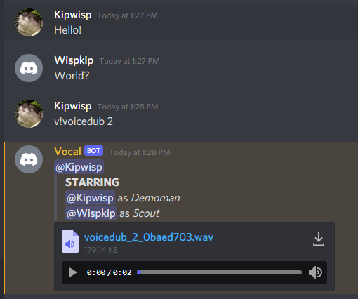

# Vocal
[](https://github.com/Kipwisp/vocal/actions/workflows/node.js.yml)
[](https://github.com/Kipwisp/vocal/blob/master/LICENSE)

Vocal is a Discord bot that utilizes fifteen's application to send generated voices from popular fictional characters upon user request. 
Be sure to check out fifteen's wonderful tool that makes this project possible at [15.ai](https://15.ai/).

## Table of contents
* [Setting up](#setting-up)
* [Authenticating](#authenticating)
* [Configuring](#configuring)
* [Running](#running)
* [Testing](#testing)
* [Commands](#commands)
* [Demos](#demos)
* [Dependencies](#dependencies)
* [Licensing](#licensing)


## Setting up
Vocal runs on a Node.js server. If you do not have Node.js installed, install it [here](https://nodejs.org/en/download/).

To set up the bot, install the required dependencies for it with the following command:
```
npm install && npm run prepare
```
Then run the script to automatically generate the character codes for the bot which will be saved to the `resources` directory as `characters.json`:
```
npm run generate
```

## Authenticating
Before the bot can be ran, a authentication file must be created named `auth.json`. Make sure you place the `auth.json` file in the root directory of the repository.

`auth.json` defines the following parameters:
  * token: The unique token for your Discord bot
  * client_id: The client ID for your Discord bot

An example `auth.json` is shown here:
```
{ 
  "token": "XXXXXXXXXXXXXXXXXXXXXXXX.XXXXXX.XXXXXXXXXXXXXXXXXXXXXXXXXXX",
  "client_id": "000000000000000000",
}
```

## Configuring
The bot can be configured using `config.json`. 

`config.json` defines the following parameters:
  * prefix: The prefix the bot looks for in a message in order to be activated
  * char_limit: The maximum number of characters allowed for a message (300 characters is currently the maximum 15.ai allows)
  * help_ttl: The amount of idle time in milliseconds before a help message expires

## Running
Run the following command to start the bot:
```
npm run start
```
Upon the bot successfully logging into Discord, a message should appear stating `Logged in as [bot name]!` in the console.

## Testing
Run the following command to run the test suite for the bot:
```
npm test
```

## Commands
The bot has the following commands:

 * **Voice File** (_\<prefix\>\<character code\> \<message\>_) - The bot will reply with a .wav file of the requested voice.
 * **Voice Join** (_\<prefix\>\<character code\>+ \<message\>_) - The bot will join the voice channel the user is in and play the requested voice.
 * **Voice Dub** (_\<prefix\>voicedub n -\<character code\> -\<character code\> -\<character code\>..._) - The bot will create a 'voice dub' of the last n messages using the characters specified or random characters otherwise.
 * **Help** (_\<prefix\>help_) - The bot will reply with a general format on how to make a voice request and all the character codes for their respective characters.
 * **Invite** (_\<prefix\>invite_) - The bot will send its invite link.
 * **Status** (_\<prefix\>status_) - Checks the current status of the 15.ai API.

## Demos

### Voice File Demo:


### Voice Join Demo:


### Voice Dub Demo:



## Dependencies
  * [Discord.js](https://discord.js.org/)
  * [Bent](https://github.com/mikeal/bent)
  * [Mocha](https://mochajs.org/)
  * [Sinon](https://sinonjs.org/)
  * [Async-Mutex](https://www.npmjs.com/package/async-mutex)

## Licensing
This project is licensed under the GNU GPLv3 - see [LICENSE](https://raw.githubusercontent.com/Kipwisp/vocal/master/LICENSE?token=AOSFA3HRIRAR4EIZHD4QQC26RUHEO) for details.
